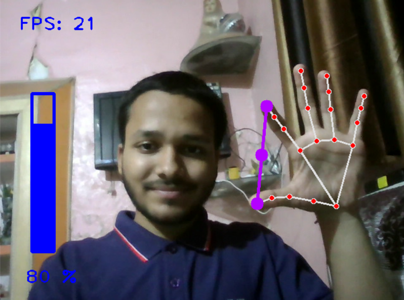

# 🤚 **Gestune**

Control your system volume with hand gestures! It's a fun, touch-free way to manage audio levels without reaching for the keyboard or mouse. 

---



---

## 🚀 Features

| Feature | Description |
|----------|--------------|
| ✋ **Hand Gestures** | Control system volume using hand gestures — pinch to decrease, spread to increase . |
| 🤖 **AI-Powered Tracking** | Uses **MediaPipe** for hand tracking and **OpenCV** for capturing video in real time. |
| 🎧 **System Integration** | Seamlessly integrates with system audio volume using **PyCaw**. |
| ⚡ **Lightweight & Easy to Use** | Fast, efficient, and simple to set up for a smooth user experience. |

---

## ⚙️ Requirements

Install the following dependencies -

```bash
pip install opencv-python mediapipe pyautogui numpy
```

---

## 📝 How to Use

1. **Clone the repository:**

```bash
git clone https://github.com/KrishBharadwaj5678/Gestune.git
cd Gestune
```

2. **Run the script:**

```bash
python VolumeHandControl.py
```

3. **Make gestures** ✋ in front of your camera to control the system's volume:
    - 🤏 **Pinch** your thumb and second finger together to decrease the volume.
    - ✋ **Spread** your thumb and second finger apart to increase the volume.

---

## 🤝 Contributing

We welcome contributions! If you'd like to contribute, feel free to fork the repository and submit a pull request. Here are a few ways you can help:
- 🐞 Bug fixes
- 🛠️ Code improvements
- ✨ Feature requests
