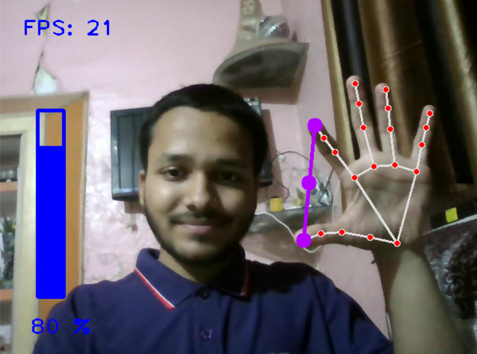

# 🤚 **Gestune**

Control your system volume with hand gestures! It's a fun, touch-free way to manage audio levels without reaching for the keyboard or mouse. 



## 🚀 Features

| Feature | Description |
|----------|--------------|
| ✋ **Hand Gestures** | Control system volume using hand gestures — pinch to decrease, spread to increase . |
| 🤖 **AI-Powered Tracking** | Uses **MediaPipe** for hand tracking and **OpenCV** for capturing video in real time. |
| 🎧 **System Integration** | Seamlessly integrates with system audio volume using **PyCaw**. |
| ⚡ **Lightweight & Easy to Use** | Fast, efficient, and simple to set up for a smooth user experience. |

---

## ⚙️ Requirements

Install the following dependencies -

```bash
pip install opencv-python mediapipe pyautogui numpy
```

## 📝 How to Use

1. **Clone the repository:**

```bash
git clone https://github.com/KrishBharadwaj5678/Gestune.git
cd Gestune
```

2. **Run the script:**

```bash
python VolumeHandControl.py
```

3. **Make gestures** ✋ in front of your camera to control the system's volume:
    - 🤏 **Pinch** your thumb and second finger together to decrease the volume.
    - ✋ **Spread** your thumb and second finger apart to increase the volume.

---

## Contributing 🤝

Want to contribute? Here's how:

1. 🍴 Fork the repository.
2. 🌿 Create a new branch (`git checkout -b feature-name`).
3. ✍️ Make your changes and commit them (`git commit -am 'Add feature-name'`).
4. 🚀 Push to your branch (`git push origin feature-name`).
5. 🔄 Submit a pull request to merge into the main branch.
